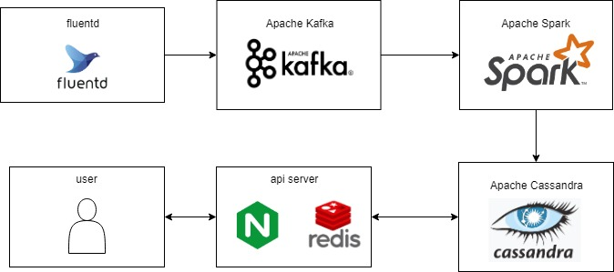

# Solution Design

## 1. 要件

- １日に数十億の書き込み処理
- 大量の読み取りクエリ/時系列メトリクス
- 最大１時間の遅れで測定
- 最小限のダウンタイム
- 履歴データの再処理

## 2. 設計

## 3.システム

#### 概要

    1. 各種ログやデータをfluendを用いてメッセージキューのkafkaに登録
    2. kafkaからデータを取得したsparkにてデータ処理
    3. 処理結果をcassandraに登録
    4. ユーザーからのリクエストにapi serverからcassandraへ照会
    5. 結果をキャッシュに保存しユーザーへ返す
